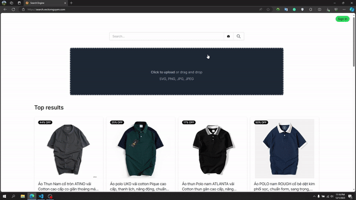
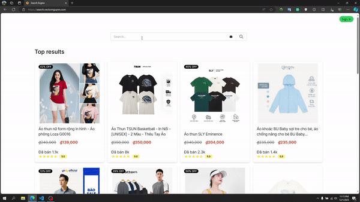

# Search Engine

[](https://github.com/vectornguyen76/search-engine/actions/workflows/development_pipeline.yml)
[](https://github.com/vectornguyen76/search-engine/actions/workflows/staging_pipeline.yml)
[](https://github.com/vectornguyen76/search-engine/actions/workflows/production_pipeline.yml)

## Architecture

  <p align="center">
  
  <br>
  <em>System Architecture</em>
  </p>

## Demo
```
  <p align="center">
    
    <br>
    <em>Image Search Demo</em>
    </p>
  </p>

  <p align="center">
    
    <br>
    <em>Text Search Demo</em>
    </p>
  </p>
```
