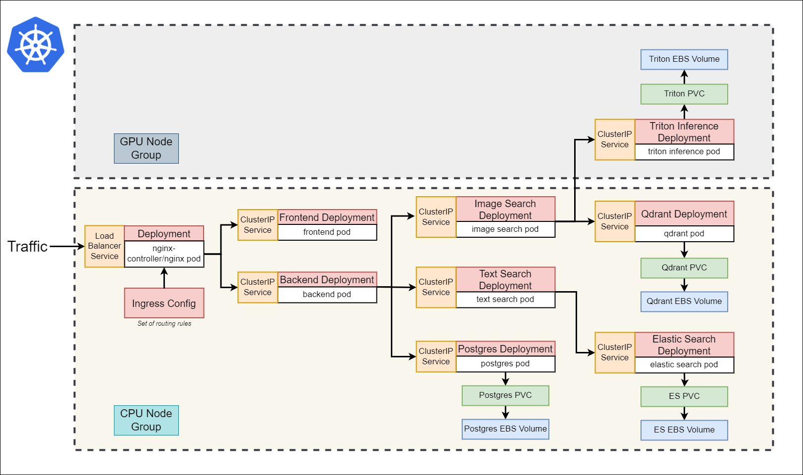
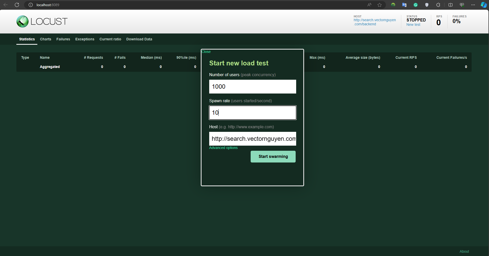
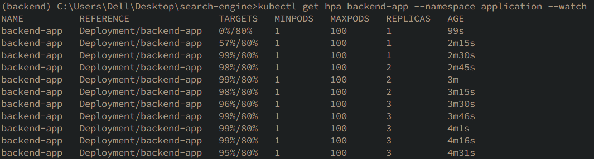
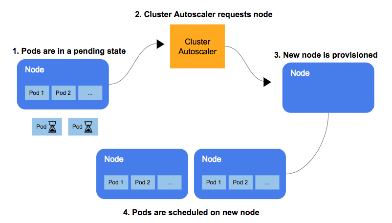
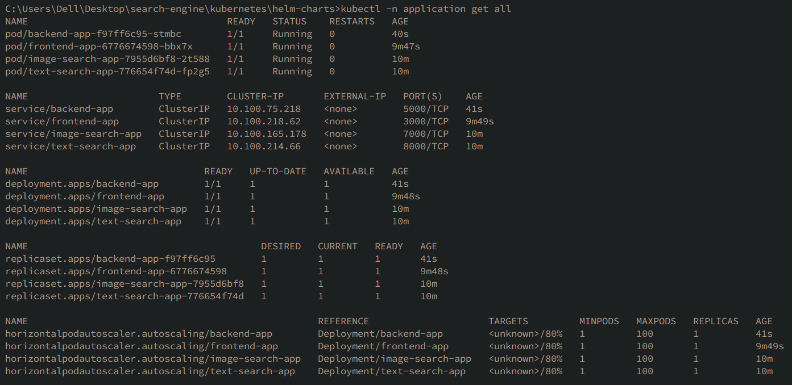
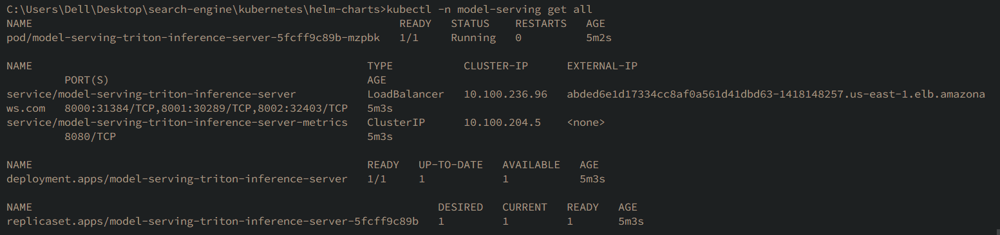

# Helm Charts for Kubernetes

## Overview
Helm is a package manager for Kubernetes, simplifying the process of defining, installing, and upgrading Kubernetes applications. This document provides guidelines and references for using Helm Charts with various Kubernetes services and tools.

## Table of Contents
1. [Architecture](#architecture)
2. [Create Cluster and NodeGroup](#create-cluster-and-nodegroup)
3. [Model Repository S3](#model-repository-s3)
4. [Install aws-ebs-csi-driver](#install-aws-ebs-csi-driver)
5. [Install Metric Server](#install-metric-server)
6. [Install Cluster Autoscaler](#install-cluster-autoscaler)
7. [Install Charts](#install-charts)
   - [Ingress Nginx Controller](#ingress-nginx-controller)
   - [Postgresql](#postgresql)
   - [Elastic Search](#elastic-search)
   - [Qdrant](#qdrant)
   - [Prometheus and Grafana](#prometheus-and-grafana)
   - [Triton Inference Server](#triton-inference-server)
   - [Image Search Application](#image-search-application)
   - [Text Search Application](#text-search-application)
   - [Backend Application](#backend-application)
   - [Frontend Application](#frontend-application)
8. [Load Test Autoscaling](#load-test-autoscaling)
   - [Test Backend Horizontal Pod Autoscaling](#test-backend-horizontal-pod-autoscaling)
   - [Test Cluster Autoscaler ](#test-cluster-autoscaler)
9. [Upgrade Charts](#upgrade-charts)
10. [Uninstall Charts](#uninstall-charts)
11. [Clean up PVC](#clean-up-pvc)
12. [Check Resources](#check-resources)
13. [References](#references)

## Architecture

<p align="center">
  
  <br>
  <em>Fig: Kubernetes Architecture</em>
</p>

## Create Cluster and NodeGroup

- **Creating a Cluster and Node Group**

  ```
  eksctl create cluster -f cluster-config-eksctl.yaml
  ```

   <p align="center">
   
   <br>
   <em>Fig: Creating a Cluster and Node Group</em>
   </p>

- **Deleting a Cluster and Node Group**

  ```
  eksctl delete cluster -f cluster-config-eksctl.yaml --disable-nodegroup-eviction --wait
  ```

   <p align="center">
   
   <br>
   <em>Fig: Deleting a Cluster and Node Group</em>
   </p>

## Model Repository S3
Instructions to create an S3 bucket and copy a model repository from local to S3.

- **Create S3 Bucket**
  ```bash
  aws s3api create-bucket --bucket qai-triton-repository --region us-east-1
  ```
- **Copy Model Repository**
  ```bash
  aws s3 cp ./../triton-server/model_repository s3://qai-triton-repository/model_repository --recursive
  ```

## Install aws-ebs-csi-driver
You may deploy the EBS CSI driver via Kustomize, Helm, or as an [Amazon EKS managed add-on](https://docs.aws.amazon.com/eks/latest/userguide/managing-ebs-csi.html).

1. **Kustomize**
```sh
kubectl apply -k "github.com/kubernetes-sigs/aws-ebs-csi-driver/deploy/kubernetes/overlays/stable/?ref=release-1.25"
```

2. **Helm**
- Add the `aws-ebs-csi-driver` Helm repository.
   ```sh
   helm repo add aws-ebs-csi-driver https://kubernetes-sigs.github.io/aws-ebs-csi-driver
   helm repo update
   ```

- Install the latest release of the driver.
   ```sh
   helm upgrade --install aws-ebs-csi-driver \
      --namespace kube-system \
      aws-ebs-csi-driver/aws-ebs-csi-driver
   ```

   Review the [configuration values](https://github.com/kubernetes-sigs/aws-ebs-csi-driver/blob/master/charts/aws-ebs-csi-driver/values.yaml) for the Helm chart.

## Install Metric Server
Metrics Server collects resource metrics from Kubelets and exposes them in Kubernetes apiserver through [Metrics API]
for use by [Horizontal Pod Autoscaler] and [Vertical Pod Autoscaler]. Metrics API can also be accessed by `kubectl top`,
making it easier to debug autoscaling pipelines.

[Metrics API]: https://github.com/kubernetes/metrics
[Horizontal Pod Autoscaler]: https://kubernetes.io/docs/tasks/run-application/horizontal-pod-autoscale/
[Vertical Pod Autoscaler]: https://github.com/kubernetes/autoscaler/tree/master/vertical-pod-autoscaler/

1. **Kustomize**
```sh
kubectl apply -f https://github.com/kubernetes-sigs/metrics-server/releases/latest/download/components.yaml
```

2. **Helm**
- Add the `metrics-server` Helm repository.
   ```sh
   helm repo add metrics-server https://kubernetes-sigs.github.io/metrics-server/
   
   ```

- Install the latest release.
   ```sh
   helm upgrade --install metrics-server metrics-server/metrics-server
   ```

## Install Cluster Autoscaler
On AWS, Cluster Autoscaler utilizes Amazon EC2 Auto Scaling Groups to manage node groups. Cluster Autoscaler typically runs as a Deployment in your cluster.

Create a Cluster Autoscaler deployment and service account:
   ```bash
   kubectl apply -f https://raw.githubusercontent.com/kubernetes/autoscaler/master/cluster-autoscaler/cloudprovider/aws/examples/cluster-autoscaler-autodiscover.yaml
   ```

## Install Charts
Step-by-step instructions to create namespaces and install various Helm charts like Ingress Nginx Controller, Postgresql, Elastic Search, Qdrant, Prometheus, Grafana, and others.

- **Create Namespaces**
  ```bash
  kubectl create namespace ingress-nginx
  kubectl create namespace application
  kubectl create namespace database
  kubectl create namespace model-serving
  kubectl create namespace monitoring
  ```

### Ingress Nginx Controller
   Installs the Ingress Nginx controller using Helm.
   ```bash
   helm install ingress-nginx ./ingress-nginx --namespace ingress-nginx
   ```

### Postgresql
   Build dependencies and then install Postgresql Helm Chart.
   ```bash
   helm dependency build ./postgresql
   helm install database ./postgresql --namespace database --set auth.username=db_user,auth.password=db_password,auth.database=db_dev
   ```

### Elastic Search
   Build dependencies and then install Elastic Search Helm Chart.
   ```bash
   helm dependency build ./elasticsearch
   helm install elasticsearch ./elasticsearch --namespace database --set master.masterOnly=false,master.replicaCount=1,data.replicaCount=0,coordinating.replicaCount=0,ingest.replicaCount=0,master.nodeSelector.nodegroup-type=cpu-nodegroup
   ```

### Qdrant
   Install Qdrant Helm Chart for vector search engine.
   ```bash
   helm install qdrant ./qdrant --namespace database --set nodeSelector.nodegroup-type=cpu-nodegroup
   ```

### Prometheus and Grafana
   Install Prometheus and Grafana for monitoring. Assumes availability of Prometheus and Grafana.
   ```bash
   helm dependency build ./kube-prometheus-stack
   helm install monitoring ./kube-prometheus-stack --namespace monitoring --set prometheus.prometheusSpec.serviceMonitorSelectorNilUsesHelmValues=false
   ```
   Port-forward to Prometheus and Grafana services for local access.
   ```bash
   kubectl port-forward service/monitoring-grafana 8080:80 --namespace monitoring
   kubectl port-forward service/monitoring-kube-prometheus 9090:9090 --namespace monitoring
   ```

### Triton Inference Server
   Load models from AWS S3 and deploy the inference server using Helm.
   Convert AWS credentials to base64 and update `values.yaml`.
   ```bash
   echo -n 'REGION' | base64
   echo -n 'SECRECT_KEY_ID' | base64
   echo -n 'SECRET_ACCESS_KEY' | base64
   ```
   Update model repository path in `values.yaml`.
   ```yaml
   modelRepositoryPath: s3://qai-triton-repository/model_repository
   ```
   Deploy the inference server.
   ```bash
   helm install model-serving ./triton-inference-server --namespace model-serving --set nodeSelector.nodegroup-type=gpu-nodegroup
   ```

### Image Search Application
   Install Image Search Application Helm Chart.
   ```bash
   helm install image-search-app ./image-search --namespace application --set nodeSelector.nodegroup-type=cpu-nodegroup
   ```

### Text Search Application
   Install Text Search Application Helm Chart.
   ```bash
   helm install text-search-app ./text-search --namespace application --set nodeSelector.nodegroup-type=cpu-nodegroup
   ```

### Backend Application
   Install Backend Application Helm Chart.
   ```bash
   helm install backend-app ./backend --namespace application --set nodeSelector.nodegroup-type=cpu-nodegroup
   ```

### Frontend Application
   Install Frontend Application Helm Chart.
   ```bash
   helm install frontend-app ./frontend --namespace application --set nodeSelector.nodegroup-type=cpu-nodegroup
   ```

## Load Test Autoscaling

### Test Backend Horizontal Pod Autoscaling

1. **Use Locust for Load Test**

   Navigate to the `locust` directory within the backend application and run Locust.

   ```bash
   cd ../backend/locust
   locust
   ```

2. **Access Locust Web Interface**
   Visit `http://localhost:8089` in your web browser to access the Locust web interface.

   <p align="center">
   
   <br>
   <em>Fig: Start Locust</em>
   </p>

3. **Track Backend Application Scaling**
   Run the following command to monitor the Horizontal Pod Autoscaler (HPA) for the backend application.

   ```bash
   kubectl get hpa backend-app --namespace application --watch
   ```

   - **Scale Up on Increased Load:**

      As the number of users increases in the Locust test, observe the backend-app pod scaling up.

      <p align="center">
      
      <br>
      <em>Fig: Test HPA Scale Up</em>
      </p>

   - **Scale Down after Load Stops:**

      When the Locust test is stopped, monitor the backend-app pod scaling down.

      <p align="center">
      
      <br>
      <em>Fig: Test HPA Scale Down</em>
      </p>

   - **Locust Test in Progress:**

      View the Locust test results on the web interface.

      <p align="center">
      
      <br>
      <em>Fig: Locust Test</em>
      </p>

### Test Cluster Autoscaler 

   <p align="center">
   
   <br>
   <em>Fig: Cluster Autoscaler</em>
   </p>


## Upgrade Charts
Instructions on how to upgrade existing Helm Chart releases.

```bash
helm upgrade [RELEASE_NAME] [CHART_NAME] --version [NEW_VERSION] -f [VALUES_FILE]
```

## Uninstall Charts
Guidelines to list and uninstall Helm Chart releases.

```bash
helm list
helm uninstall [RELEASE_NAME]
```

## Clean up PVC

Deleting PVCs is irreversible and can lead to data loss. Ensure backups are in place before proceeding.

1. **List All PVCs**
   To view all PVCs across all namespaces:
   ```bash
   kubectl get pvc --all-namespaces
   ```

2. **Delete All PVCs**
   To remove all PVCs in the cluster:
   ```bash
   kubectl delete pvc --all --all-namespaces
   ```

3. **Delete PVCs in a Specific Namespace**
   To delete PVCs in a particular namespace:
   ```bash
   kubectl delete pvc --all -n <namespace>
   ```
   Replace `<namespace>` with the desired namespace name.

4. **Verify Deletion**
   To confirm the PVCs have been removed:
   ```bash
   kubectl get pvc --all-namespaces
   ```

## Check resources 
   <p align="center">
   
   <br>
   <em>Fig: Namespace Application</em>
   </p>

   <p align="center">
   
   <br>
   <em>Fig: Namespace Database</em>
   </p>

   <p align="center">
   
   <br>
   <em>Fig: Namespace Ingress Nginx</em>
   </p>

   <p align="center">
   
   <br>
   <em>Fig: Namespace Model Serving</em>
   </p>

   <p align="center">
   
   <br>
   <em>Fig: Persistent Volume Claim (PVC)</em>
   </p>

   <p align="center">
   
   <br>
   <em>Fig: Prometheus and Grafana</em>
   </p>

## References
- [Bitnami Charts](https://github.com/bitnami/charts)
- [NetApp Postgres Helm Chart](https://docs.netapp.com/us-en/astra-control-center-2204/solutions/postgres-deploy-from-helm-chart.html#requirements)
- [Helm Official Install Guide](https://helm.sh/docs/intro/install/)
- [Ingress Nginx GitHub Repository](https://github.com/kubernetes/ingress-nginx)
- [Triton Inference Server AWS Deployment Guide](https://github.com/triton-inference-server/server/tree/main/deploy/aws)
- [Prometheus Community Helm Charts](https://github.com/prometheus-community/helm-charts/tree/main/charts/kube-prometheus-stack)
- [Qdrant Helm Charts](https://github.com/qdrant/qdrant-helm/tree/main/charts/qdrant)
- [Elastic Cloud on Kubernetes Documentation](https://www.elastic.co/guide/en/cloud-on-k8s/current/k8s-stack-helm-chart.html)
- [CSI driver for Amazon EBS](https://github.com/kubernetes-sigs/aws-ebs-csi-driver)
- [Kubernetes Metrics Server](https://github.com/kubernetes-sigs/metrics-server)
- [Autoscaling in Kubernetes](https://kubernetes.io/blog/2016/07/autoscaling-in-kubernetes/)
- [Cluster Autoscaler on AWS](https://github.com/kubernetes/autoscaler/blob/master/cluster-autoscaler/cloudprovider/aws/README.md)