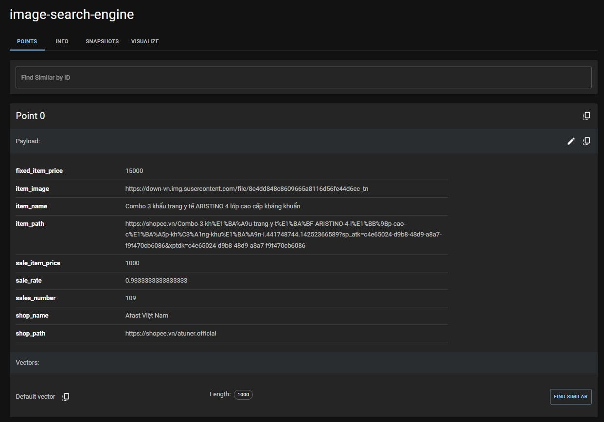

# Shopee Image Search Engine

## About the Solution
This project implements an image search engine for Shopee using qdrant as the vector database for efficient similarity search. The choice of qdrant over faiss was made to start with a small server that runs on CPU and scales when there is a significant increase in traffic.

## Vector Database - Vector Search

### Faiss
1. **Overview**
    - Faiss is a powerful library designed for efficient similarity search and clustering of dense vectors. It supports searching in sets of vectors of any size, even those that may not fit in RAM. Faiss is written in C++ with complete Python/numpy wrappers and is highly versatile, finding applications in recommendation systems, image retrieval, and more.

2. **Key Features**
    - **Distance Metrics**: Faiss supports a range of distance metrics including L2 (Euclidean) distances, dot products, and cosine similarity for comparing vectors.
    - **GPU Support**:
        + *GPU Implementation*: Faiss provides GPU support for efficient vector search.
        + *Compatibility*: Faiss can seamlessly handle input from both CPU and GPU memory.
        + *Performance*: Faiss can significantly enhance performance when both input and output remain resident on the GPU.
        + *Multi-GPU Usage*: Faiss supports both single and multi-GPU usage.

3. **Disadvantages**
    - Faiss does not support real-time updates. To implement real-time updates, you will need to create a custom wrapper around it or use a framework that supports CRUD operations, high availability, horizontal scalability, concurrent access, and more.

4. **Reference**
    - [Faiss GitHub Repository](https://github.com/facebookresearch/faiss)

### Vector Search in ElasticSearch
1. **Overview**
    - ElasticSearch is a widely-used search engine that developers commonly employ to implement search functionality in their applications. With Vector Search, ElasticSearch enables developers to search for documents based on semantic similarity, going beyond simple textual relevance. This feature has diverse use cases, including semantic search, recommendation systems, image search, and question answering.

2. **Advantages**
    - It is highly scalable, capable of handling large-scale data and high user concurrency.
    - Supports asynchronous client operations.

3. **Disadvantages**
    - Does not support GPU directly but can be extended with third-party plugins.
    - Elasticsearch tends to be slower than its competitors across various datasets and metrics.
    - Does not natively support batch vector search.

4. **Pricing**
    - Storing and searching embeddings are free.
    - Embedding models or built-in semantic search models come at a cost, with a price of $125 per month for Machine learning.

5. **Examples**
    - **Create the index**
        ```shell
        PUT my-index
        {
            "mappings": {
                "properties": {
                    "my_vector": {
                        "type": "dense_vector",
                        "dims": 384,
                        "index": true,
                        "similarity": "cosine"
                    },
                    "my_text" : {
                        "type" : "text"
                    }
                }
            }
        }
        ```
    - **Index a document**
        ```shell
        PUT my-index/_doc/1
        {
            "my_vector" : [0.5, 10, 6, ….],
            "my_text" :"Jamaica's tropical climate brings warmth all year round"
        }
        ```
    - **Run vector search with deployed text embedding model**
        ```shell
        POST my-index/_search
        {
            "knn": {
                "field": "my_vector",
                "query_vector_builder": {
                    "text_embedding": {
                        "model_id": "sentence-transformers__all-minilm-l6-v2",
                        "model_text": "How is the weather in Jamaica?"
                    }
                },
                "k": 10,
                "num_candidates": 100
            }
        }
        ```
    - **Run vector search directly**
        ```shell
        POST my-index/_search
        {
            "knn": {
                "field": "my_vector",
                "query_vector": [0.3, 0.1, 1.2, ...],
                "k": 10,
                "num_candidates": 100
            },
        }
        ```

6. **References**
    - [Elasticsearch KNN Search](https://www.elastic.co/guide/en/elasticsearch/reference/current/knn-search.html#knn-semantic-search)
    - [Elasticsearch KNN Search API](https://www.elastic.co/guide/en/elasticsearch/reference/current/knn-search-api.html)

### Qdrant
1. **Overview**
    - Qdrant is a vector similarity search engine and vector database that offers a production-ready service with a user-friendly API for storing, searching, and managing vectors along with additional payload data. Qdrant is specifically tailored to support extended filtering, making it suitable for various applications such as neural-network or semantic-based matching, faceted search, and more. It is written in Rust for speed and reliability, even under high loads.

2. **Advantages**
    - Implements a custom modification of the HNSW algorithm for Approximate Nearest Neighbor Search, combining state-of-the-art speed with advanced filtering capabilities.
    - Supports both CPU and GPU-based computing, providing flexibility for different hardware configurations.
    - Highly scalable, capable of handling large-scale data and high user concurrency.
    - Supports batch vector search.
    - Offers asynchronous client operations.

3. **Benchmark**
    - 

4. **References**
    - [Qdrant Benchmarks](https://qdrant.tech/benchmarks/)
    - [Batch Vector Search with Qdrant](https://blog.qdrant.tech/batch-vector-search-with-qdrant-8c4d598179d5)
    - [Qdrant GitHub Repository](https://github.com/qdrant/qdrant/issues/1656)

## Machine Learning Model Serving Platform

### Triton Inference Server
1. **Overview**
    <p align="center">
    
    <br>
    <em>Batching Architecture</em>
    </p>

    - Triton Inference Server is an open-source software platform designed for deploying and managing AI models at scale. It supports a wide range of deep learning and machine learning frameworks, including TensorFlow, PyTorch, ONNX, and OpenVINO. Triton can be deployed on various hardware platforms, including CPUs, GPUs, and FPGAs.

    - Triton is engineered for high performance and scalability, employing techniques such as batching, concurrency, and model optimization to achieve low latency and high throughput. It can be scaled to handle a large volume of inference
    requests.

    - Triton offers flexibility and ease of use, supporting deployment options like on-premises, cloud, and edge. It can also be integrated with existing infrastructure, such as Kubernetes and cloud orchestration platforms.

2. **Key Features**
    - **High Performance**: Triton is optimized for high throughput and low latency inference.
    - **Scalability**: It can handle a large number of inference requests, making it suitable for real-time applications like video processing and natural language processing.
    - **Flexibility**: Triton supports various deployment options and can be integrated with existing infrastructure.
    - **Ease of Use**: Triton provides tools for deploying, managing, and monitoring AI models in production.

3. **Conclusion**
    - Triton Inference Server is a powerful and flexible platform for deploying AI models at scale. It is a popular choice for companies and organizations needing to deploy AI models in production.

4. **References**
    - [Triton Inference Server GitHub Repository](https://github.com/triton-inference-server/client/blob/main/src/python/examples/image_client.py)
    - [Triton Inference Server Architecture](https://github.com/triton-inference-server/server/blob/main/docs/user_guide/architecture.md#models-and-schedulers)
    - [BentoML vs. Triton Inference Server](https://www.bentoml.com/blog/bentoml-or-triton-inference-server-choose-both)

### BentoML
1. **Overview**
    <p align="center">
    
    <br>
    <em>Batching Architecture</em>
    </p>

    - BentoML is an open-source platform for deploying and managing machine learning models in production. It provides a number of features that make it easy to get started, such as model packaging, deployment, and monitoring.

2. **Key Features**
    - Model packaging: BentoML provides a simple way to package machine learning models for production. Bentos can be created from a variety of popular machine learning frameworks, including TensorFlow, PyTorch, and scikit-learn.

    - Model deployment: BentoML provides a variety of options for deploying machine learning models in production. Bentos can be deployed to on-premises servers, cloud platforms, and edge devices.

    - Model monitoring: BentoML provides a number of tools for monitoring the performance and health of machine learning models in production. BentoML can track metrics such as latency, accuracy, and throughput.

3. **Conclusion**
    - BentoML is a powerful and flexible platform for deploying and managing machine learning models in production. It is a popular choice for companies and organizations that need to deploy machine learning models at scale.

4. **References**
    - [BentoML Batching Guide](https://docs.bentoml.org/en/latest/guides/batching.html)
    - [BentoML](https://www.bentoml.com/blog/bentoml-or-triton-inference-server-choose-both)

## Environments
### Development Environment
1. **Create Environment and Install Packages**
    ```shell
    conda create -n image-search python=3.10
    ```
    ```shell
    conda activate image-search
    ```
    ```shell
    pip install -r requirements.txt
    ```

2. **Run the Application**
    ```
    uvicorn app:app
    ```

### Results
<p align="center">

<br>
<em>Qdrant Vector Store</em>
</p>
<br>
- Created and added 100,000 points in 6 minutes in qdrant.
- p95: [Provide Performance Data]