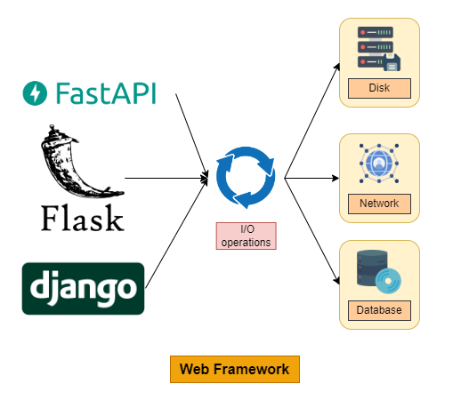
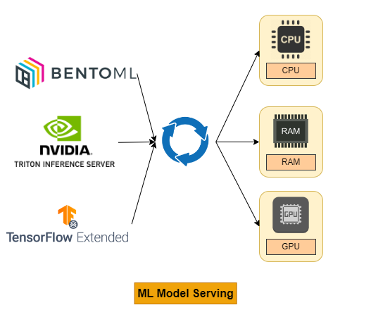
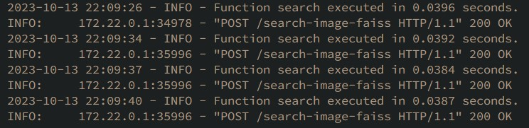
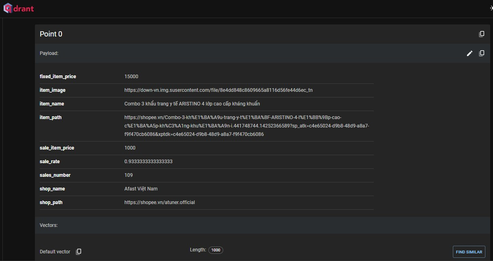
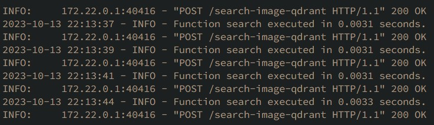
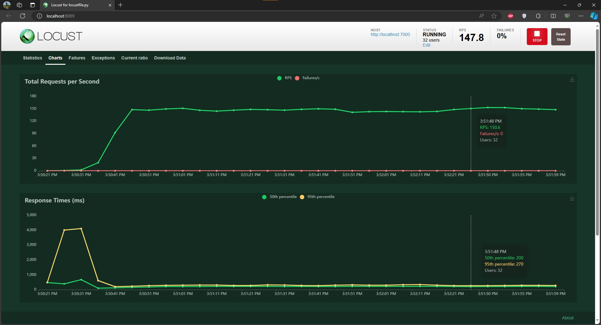
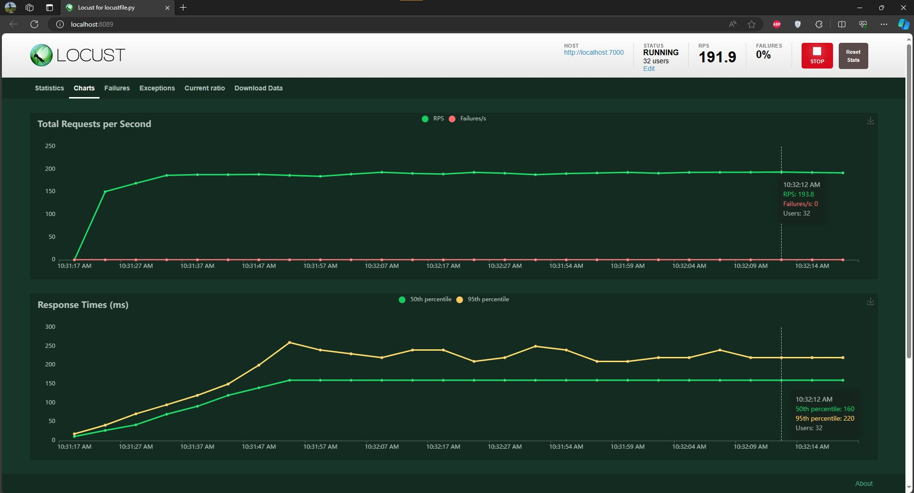

# Shopee Image Search Engine

## Table of Contents

1. [About the Solution](#about-the-solution)
2. [Web Framework for ML Services](#web-framework-for-ml-services)
   - [FastAPI](#fastapi)
3. [Machine Learning Model Serving Platform](#machine-learning-model-serving-platform)
   - [Triton Inference Server](#triton-inference-server)
   - [BentoML](#bentoml)
4. [Vector Database - Vector Search](#vector-database---vector-search)
   - [Faiss](#faiss)
   - [Vector Search in ElasticSearch](#vector-search-in-elasticsearch)
   - [Qdrant](#qdrant)
5. [Strategies for Improving Image Retrieval](#strategies-for-improving-image-retrieval)
6. [Development Environment](#development-environment)
7. [Testing and Results](#testing-and-results)
   - [Locust Tool](#locust-tool)
   - [Test Faiss](#test-faiss)
   - [Test Qdrant](#test-qdrant)
   - [Inference without Triton](#inference-without-triton)
   - [Test Triton](#test-triton)
8. [References](#references)

## About the Solution

This project implements an image search engine for Shopee using qdrant as the vector database for efficient similarity search. The choice of qdrant over faiss was made to start with a small server that runs on CPU and scales when there is a significant increase in traffic.

## Web Framework for ML Services

<p align="center">

</p>

### FastAPI

1. **Overview**
   FastAPI is a modern, high-performance web framework designed for building APIs with Python 3.7+ that leverages standard Python type hints. It is built on top of the Starlette web server and provides a plethora of features that simplify web application development. These features include automatic data validation, error handling, and interactive API documentation.

2. **Key Features**

   - **High Performance**: FastAPI stands out as one of the fastest Python frameworks available. This speed is achieved through its use of asynchronous programming and integration with the Starlette web server.
   - **Automatic Data Validation**: By utilizing Python type hints, FastAPI automatically validates both incoming requests and outgoing responses. This enhances code robustness and error prevention.
   - **Automatic Documentation Generation**: FastAPI effortlessly generates interactive API documentation based on your code, simplifying comprehension and usage for other developers.
   - **Ease of Use**: FastAPI boasts an intuitive and straightforward syntax, making it relatively easy to learn and work with. Additionally, a wealth of documentation and tutorials is available to support developers.

3. **FastAPI for ML Services**
   <p align="center">
   
   </p>

   - While FastAPI is primarily designed for IO-intensive applications like web applications, it can be employed for building ML services.
   - The framework's asynchronous requests contribute to improved speed compared to Flask's synchronous requests.
   - It is important to note that FastAPI does not offer built-in support for Machine Learning features such as micro-batching and asynchronous inference requests.
   - When scaling workers, the models are copied, potentially increasing memory usage (RAM on CPU or VRAM on GPU).

4. **Conclusion**

   - FastAPI represents a potent and versatile web framework suitable for building ML services. Its reputation for high performance, user-friendliness, and extensive documentation is well-deserved.

   - However, it is essential to recognize that FastAPI lacks built-in support for all the typical features required for ML model serving, such as model loading, versioning, and performance monitoring. To address these needs, third-party libraries may be necessary.

   - In summary, FastAPI is a compelling choice for ML service development, especially if flexibility and performance are paramount. Nevertheless, developers should be prepared to integrate third-party solutions to fulfill specific requirements.

5. **References**
   - [FastAPI Documentation](https://fastapi.tiangolo.com/async/)
   - [Breaking Up with Flask & FastAPI: Why ML Model Serving Requires a Specialized Framework](https://bentoml.com/blog/breaking-up-with-flask-amp-fastapi-why-ml-model-serving-requires-a-specialized-framework)

## Machine Learning Model Serving Platform

<p align="center">

</p>

### Triton Inference Server

1. **Overview**
   <p align="center">
   
   <br>
   <em>Batching Architecture</em>
   </p>

   - Triton Inference Server is an open-source software platform designed for deploying and managing AI models at scale. It supports a wide range of deep learning and machine learning frameworks, including TensorFlow, PyTorch, ONNX, and OpenVINO. Triton can be deployed on various hardware platforms, including CPUs, GPUs, and FPGAs.

   - Triton is engineered for high performance and scalability, employing techniques such as batching, concurrency, and model optimization to achieve low latency and high throughput. It can be scaled to handle a large volume of inference
     requests.

   - Triton offers flexibility and ease of use, supporting deployment options like on-premises, cloud, and edge. It can also be integrated with existing infrastructure, such as Kubernetes and cloud orchestration platforms.

2. **Key Features**

   - **High Performance**: Triton is optimized for high throughput and low latency inference.
   - **Scalability**: It can handle a large number of inference requests, making it suitable for real-time applications like video processing and natural language processing.
   - **Flexibility**: Triton supports various deployment options and can be integrated with existing infrastructure.
   - **Ease of Use**: Triton provides tools for deploying, managing, and monitoring AI models in production.

3. **FastAPI with Triton Inference Server**
   <p align="center">
   
   <br>
   <em>FastAPI - Triton Inference Server Architecture</em>
   </p>

   Using FastAPI with Triton Server is a more flexible approach to deploying and serving AI models with Python. FastAPI is a modern, high-performance web framework that is easy to use and extend. Triton Server is a high-performance inference serving software that can be used to deploy and serve AI models on CPUs, GPUs, and other accelerators.

4. **PyTriton**

   PyTriton is a Flask/FastAPI-like interface that simplifies Triton's deployment in Python environments. It provides a simple and intuitive way to deploy and serve AI models with Triton Server.

   ```python
   import pytriton

   app = pytriton.App()

   # Define the model.
   model = pytriton.Model(
      "linear_regression",
      "linear_regression.model",
      [pytriton.Input("data", pytriton.DataType.FLOAT32, (-1, 1))],
      [pytriton.Output("prediction", pytriton.DataType.FLOAT32, (1,))],
   )

   # Deploy the model.
   app.deploy(model)

   # Start the Triton Inference Server.
   app.start_triton()

   # Serve the model.
   app.serve()

   ```

   Once you have started the PyTriton application, you can access the model through its HTTP/gRPC API. For example, to make a prediction using the model, you can send an HTTP POST request to the /predict endpoint with the input data in the request body.

5. **FastAPI with Triton Server and PyTriton**

   - Both FastAPI with Triton Server and PyTriton are good options for deploying and serving AI models with Python. However, there are some key differences between the two approaches:

     - _Flexibility_: FastAPI with Triton Server is a more flexible approach. You can use FastAPI to create custom APIs that expose your models in a variety of ways. PyTriton is less flexible, but it is easier to use.
     - _Performance_: FastAPI with Triton Server can be more performant than PyTriton, especially if you are using a complex model or a large dataset.
     - _Ease of use_: PyTriton is easier to use than FastAPI with Triton Server. PyTriton provides a simple and intuitive interface for deploying and serving models.

6. **Conclusion**

   - Triton Inference Server is a powerful and flexible platform for deploying AI models at scale. It is a popular choice for companies and organizations needing to deploy AI models in production.

7. **References**
   - [Triton Inference Server GitHub Repository](https://github.com/triton-inference-server/client/blob/main/src/python/examples/image_client.py)
   - [Triton Inference Server Architecture](https://github.com/triton-inference-server/server/blob/main/docs/user_guide/architecture.md#models-and-schedulers)
   - [BentoML vs. Triton Inference Server](https://www.bentoml.com/blog/bentoml-or-triton-inference-server-choose-both)
   - [FastAPI + gRPC AsyncIO + Triton GitHub Repository](https://github.com/Curt-Park/mnist-fastapi-aio-triton)
   - [Best Tools to Do ML Model Serving](https://neptune.ai/blog/ml-model-serving-best-tools)
   - [Pytriton GitHub Repository](https://github.com/triton-inference-server/pytriton)

### BentoML

1. **Overview**
   <p align="center">
   
   <br>
   <em>Batching Architecture</em>
   </p>

   - BentoML is an open-source platform for deploying and managing machine learning models in production. It provides a number of features that make it easy to get started, such as model packaging, deployment, and monitoring.

2. **Key Features**

   - Model packaging: BentoML provides a simple way to package machine learning models for production. Bentos can be created from a variety of popular machine learning frameworks, including TensorFlow, PyTorch, and scikit-learn.

   - Model deployment: BentoML provides a variety of options for deploying machine learning models in production. Bentos can be deployed to on-premises servers, cloud platforms, and edge devices.

   - Model monitoring: BentoML provides a number of tools for monitoring the performance and health of machine learning models in production. BentoML can track metrics such as latency, accuracy, and throughput.

3. **Conclusion**

   - BentoML is a powerful and flexible platform for deploying and managing machine learning models in production. It is a popular choice for companies and organizations that need to deploy machine learning models at scale.

4. **References**
   - [BentoML Batching Guide](https://docs.bentoml.org/en/latest/guides/batching.html)
   - [BentoML](https://www.bentoml.com/blog/bentoml-or-triton-inference-server-choose-both)

## Vector Database - Vector Search

### Faiss

1. **Overview**

   - Faiss is a powerful library designed for efficient similarity search and clustering of dense vectors. It supports searching in sets of vectors of any size, even those that may not fit in RAM. Faiss is written in C++ with complete Python/numpy wrappers and is highly versatile, finding applications in recommendation systems, image retrieval, and more.

2. **Key Features**

   - **Distance Metrics**: Faiss supports a range of distance metrics including L2 (Euclidean) distances, dot products, and cosine similarity for comparing vectors.
   - **GPU Support**:
     - _GPU Implementation_: Faiss provides GPU support for efficient vector search.
     - _Compatibility_: Faiss can seamlessly handle input from both CPU and GPU memory.
     - _Performance_: Faiss can significantly enhance performance when both input and output remain resident on the GPU.
     - _Multi-GPU Usage_: Faiss supports both single and multi-GPU usage.

3. **Disadvantages**

   - Faiss does not support real-time updates. To implement real-time updates, you will need to create a custom wrapper around it or use a framework that supports CRUD operations, high availability, horizontal scalability, concurrent access, and more.

4. **Reference**
   - [Faiss GitHub Repository](https://github.com/facebookresearch/faiss)

### Vector Search in ElasticSearch

1. **Overview**

   - ElasticSearch is a widely-used search engine that developers commonly employ to implement search functionality in their applications. With Vector Search, ElasticSearch enables developers to search for documents based on semantic similarity, going beyond simple textual relevance. This feature has diverse use cases, including semantic search, recommendation systems, image search, and question answering.

2. **Advantages**

   - It is highly scalable, capable of handling large-scale data and high user concurrency.
   - Supports asynchronous client operations.

3. **Disadvantages**

   - Does not support GPU directly but can be extended with third-party plugins.
   - Elasticsearch tends to be slower than its competitors across various datasets and metrics.
   - Does not natively support batch vector search.

4. **Pricing**

   - Storing and searching embeddings are free.
   - Embedding models or built-in semantic search models come at a cost, with a price of $125 per month for Machine learning.

5. **Examples**

   - **Create the index**
     ```shell
     PUT my-index
     {
         "mappings": {
             "properties": {
                 "my_vector": {
                     "type": "dense_vector",
                     "dims": 384,
                     "index": true,
                     "similarity": "cosine"
                 },
                 "my_text" : {
                     "type" : "text"
                 }
             }
         }
     }
     ```
   - **Index a document**
     ```shell
     PUT my-index/_doc/1
     {
         "my_vector" : [0.5, 10, 6, ….],
         "my_text" :"Jamaica's tropical climate brings warmth all year round"
     }
     ```
   - **Run vector search with deployed text embedding model**
     ```shell
     POST my-index/_search
     {
         "knn": {
             "field": "my_vector",
             "query_vector_builder": {
                 "text_embedding": {
                     "model_id": "sentence-transformers__all-minilm-l6-v2",
                     "model_text": "How is the weather in Jamaica?"
                 }
             },
             "k": 10,
             "num_candidates": 100
         }
     }
     ```
   - **Run vector search directly**
     ```shell
     POST my-index/_search
     {
         "knn": {
             "field": "my_vector",
             "query_vector": [0.3, 0.1, 1.2, ...],
             "k": 10,
             "num_candidates": 100
         },
     }
     ```

6. **References**
   - [Elasticsearch KNN Search](https://www.elastic.co/guide/en/elasticsearch/reference/current/knn-search.html#knn-semantic-search)
   - [Elasticsearch KNN Search API](https://www.elastic.co/guide/en/elasticsearch/reference/current/knn-search-api.html)

### Qdrant

1. **Overview**

   - Qdrant is a vector similarity search engine and vector database that offers a production-ready service with a user-friendly API for storing, searching, and managing vectors along with additional payload data. Qdrant is specifically tailored to support extended filtering, making it suitable for various applications such as neural-network or semantic-based matching, faceted search, and more. It is written in Rust for speed and reliability, even under high loads.

2. **Advantages**

   - Implements a custom modification of the HNSW algorithm for Approximate Nearest Neighbor Search, combining state-of-the-art speed with advanced filtering capabilities.
   - Supports both CPU and GPU-based computing, providing flexibility for different hardware configurations.
   - Highly scalable, capable of handling large-scale data and high user concurrency.
   - Supports batch vector search.
   - Offers asynchronous client operations.

3. **Benchmark**

   - 

4. **References**
   - [Qdrant Benchmarks](https://qdrant.tech/benchmarks/)
   - [Batch Vector Search with Qdrant](https://blog.qdrant.tech/batch-vector-search-with-qdrant-8c4d598179d5)
   - [Qdrant GitHub Repository](https://github.com/qdrant/qdrant/issues/1656)

## Strategies for Improving Image Retrieval

1. **Leveraging Deep Learning Architectures**

   Deep learning architectures, such as Convolutional Neural Networks (CNNs), can play a pivotal role in feature extraction. Utilize pre-trained models like Vision Transformers (ViTs), ResNet, VGG, or EfficientNet to extract meaningful image features.

   [Learn more](https://paperswithcode.com/sota/image-classification-on-imagenet)

2. **Utilizing Embeddings**

   Consider employing techniques like Siamese networks or triplet loss to generate embeddings for images. These embeddings help create a feature space conducive to similarity-based searches, a core aspect of image retrieval.

3. **Fine-tuning Models**

   Fine-tune pre-trained models on your dataset. Transfer learning enables you to fine-tune models to your specific task, capitalizing on the knowledge embedded in pre-trained weights.

4. **Cross-Modal Retrieval**

   Leverage both image and text information if available in your dataset. Cross-modal retrieval techniques enable you to utilize textual descriptions or tags for enhanced retrieval.

   [Learn more](https://www.sbert.net/examples/applications/image-search/README.html)

5. **Feedback Loops**

   Incorporate feedback loops where user interactions with the retrieval system inform and improve future recommendations.

## Development Environment

1. **Create Environment and Install Packages**

   ```shell
   conda create -n image-search python=3.9
   ```

   ```shell
   conda activate image-search
   ```

   ```shell
   pip install -r requirements.txt
   ```

2. **Run the Application**
   ```
   uvicorn app:app --port 7000
   ```

## Testing and Results

- Ubuntu: 20.04
- CUDA Version: 12.2
- EC2: g4dn.xlarge
- CPU: Intel Xeon Family 4-vCPUs
- RAM: 16GB
- GPU: NVIDIA T4 Tensor Core
- VRAM: 16GB
- Uvicorn Workers: 4
  FastAPI, Qdrant, Faiss, Triton, Locust are executed on the same device.

### Locust Tool

1. **Overview**

   Locust is an open-source, Python-based load testing tool that allows you to test the performance and scalability of your web applications or services. It is designed to be user-friendly, highly customizable, and easy to extend.

2. **How to run**

   ```
   pip install locust
   ```

   ```
   cd locust
   locust
   http://localhost:8089/
   ```

   <p align="center">
   
   <br>
   <em>Locust Load Test</em>
   </p>

3. **References**

- [Locust Documentation](http://docs.locust.io/en/stable/)
- [Writing a Locustfile](http://docs.locust.io/en/stable/writing-a-locustfile.html)
- [Increasing Performance](http://docs.locust.io/en/stable/increase-performance.html)
- [Running Distributed Tests](http://docs.locust.io/en/stable/running-distributed.html)

### Test Faiss

1. **Ingest Data Time**
   Create Faiss Index ~ 5 seconds.

2. **Search Time CPU**
   <p align="center">
   
   <br>
   <em>Faiss Search Time in CPU</em>
   </p>
   <br>

   About 39ms

### Test Qdrant

1. **Ingest Data Time**
   <p align="center">
   
   <br>
   <em>Point in Qdrant</em>
   </p>
   <br>

   <p align="center">
   
   <br>
   <em>Qdrant Info</em>
   </p>
   Create Collection and add 100,000 points take 6 minutes.

2. **Search Time CPU**
   <p align="center">
   
   <br>
   <em>Qdrant Search Time in CPU</em>
   </p>
   About 3ms

### Inference without Triton

1. **Report**

   - Original efficientnet_b3 model.pt
   - Uvicorn workers = 1
   - User spawn rate = 1

   | Id  | Request Concurrency | Device | p95 Latency (ms) | RPS | Max GPU Memory Usage (MB) |
   | :-: | :-----------------: | :----: | :--------------: | :-: | :-----------------------: |
   |  1  |          1          |  CPU   |       130        |  9  |             0             |
   |  2  |          1          |  GPU   |        21        | 48  |            525            |
   |  3  |          4          |  CPU   |       460        |  9  |             0             |
   |  4  |          4          |  GPU   |        85        | 49  |            525            |
   |  5  |          8          |  CPU   |       920        |  9  |             0             |
   |  6  |          8          |  GPU   |       170        | 49  |            525            |
   |  7  |         16          |  CPU   |       1800       |  9  |             0             |
   |  8  |         16          |  GPU   |       340        | 49  |            525            |
   |  9  |         32          |  CPU   |       3600       |  9  |             0             |
   | 10  |         32          |  GPU   |       650        | 50  |            525            |

   <br>
   <p align="center">
   
   <br>
   <em>32 Request Concurrency - GPU</em>
   </p>

### Test Triton

1. **Folder layout**

   ```
   model_repository/
   ├── efficientnet_b3
   │   ├── 1
   │   │   └── model.pt
   │   └── config.pbtxt
   ├── efficientnet_b3_onnx
   │  ├── 1
   │  │   └── model.onnx
   │  └── config.pbtxt
   └── efficientnet_b3_trt
      ├── 1
      │   └── model.plan
      └── config.pbtxt
   ```

2. **Dynamic Batching**

   Dynamic batching, in reference to the Triton Inference Server, refers to the functionality which allows the combining of one or more inference requests into a single batch (which has to be created dynamically) to maximize throughput.

   Dynamic batching can be enabled and configured on per model basis by specifying selections in the model's config.pbtxt. Dynamic Batching can be enabled with its default settings by adding the following to the config.pbtxt file:

   ```
   dynamic_batching { }
   ```

   While Triton batches these incoming requests without any delay, users can choose to allocate a limited delay for the scheduler to collect more inference requests to be used by the dynamic batcher.

   ```
   dynamic_batching {
      max_queue_delay_microseconds: 100
   }
   ```

   <p align="center">
   
   <br>
   <em>Dynamic Batching</em>
   </p>

3. **Concurrent Model Execution**

   The Triton Inference Server can spin up multiple instances of the same model, which can process queries in parallel. Triton can spawn instances on the same device (GPU), or a different device on the same node as per the user's specifications. This customizability is especially useful when considering ensembles that have models with different throughputs. Multiple copies of heavier models can be spawned on a separate GPU to allow for more parallel processing. This is enabled via the use of instance groups option in a model's configuration.

   <p align="center">
   
   <br>
   <em>Concurrent Model Execution</em>
   </p>

4. **Measuring Triton Performance with Performance Analyzer**

   Having made some improvements to the model's serving capabilities by enabling `dynamic batching` and the use of `multiple model instances`, the next step is to measure the impact of these features. To that end, the Triton Inference Server comes packaged with the [Performance Analyzer](https://github.com/triton-inference-server/client/blob/main/src/c++/perf_analyzer/README.md) which is a tool specifically designed to measure performance for Triton Inference Servers.

   - On a first terminal, run Triton Container

     ```
     docker compose --profile prod up triton_server
     ```

   - On a second terminal, run Triton SDK Container

     ```
     docker pull nvcr.io/nvidia/tritonserver:23.01-py3-sdk

     docker run -it --net=host -v ${PWD}:/workspace/ nvcr.io/nvidia/tritonserver:23.01-py3-sdk bash
     ```

   - On a third terminal, it is advisable to monitor the GPU Utilization to see if the deployment is saturating GPU resources.
     ```
     watch -n0.1 nvidia-smi
     ```

   To measure the performance gain, let's run performance analyzer on the following configurations:

   ```shell
   perf_analyzer -m <model name> -b <batch size> --shape <input layer>:<input shape> --concurrency-range <lower number of request>:<higher number of request>:<step>
   ```

   - **No Dynamic Batching, single model instance**: This configuration will be the baseline measurement. To set up the Triton Server in this configuration, do not add `instance_group` or `dynamic_batching` in `config.pbtxt` and make sure to include `--gpus=1` in the `docker run` command to set up the server.

     ```shell
     # Query
     perf_analyzer -m efficientnet_b3_trt -b 2 --shape input:3,300,300 --concurrency-range 2:16:2 --percentile=95

     # Summarized Inference Result
     Inferences/Second vs. Client p95 Batch Latency
     Concurrency: 2, throughput: 579.911 infer/sec, latency 7159 usec
     Concurrency: 4, throughput: 613.242 infer/sec, latency 17064 usec
     Concurrency: 6, throughput: 647.959 infer/sec, latency 26696 usec
     Concurrency: 8, throughput: 660.103 infer/sec, latency 30016 usec
     Concurrency: 10, throughput: 640.003 infer/sec, latency 39883 usec
     Concurrency: 12, throughput: 664.315 infer/sec, latency 46405 usec
     Concurrency: 14, throughput: 591.206 infer/sec, latency 57214 usec
     Concurrency: 16, throughput: 585.562 infer/sec, latency 65926 usec

     # Perf for 16 concurrent requests
     Request concurrency: 16
     Client:
        Request count: 5273
        Throughput: 585.562 infer/sec
        p50 latency: 58041 usec
        p90 latency: 64255 usec
        p95 latency: 65926 usec
        p99 latency: 69645 usec
        Avg HTTP time: 54594 usec (send/recv 2792 usec + response wait 51802 usec)
     Server:
        Inference count: 10544
        Execution count: 1200
        Successful request count: 5272
        Avg request latency: 38647 usec (overhead 120 usec + queue 9176 usec + compute input 4285 usec + compute infer 18019 usec + compute output 7047 usec)
     ```

   - **Just Dynamic Batching**: To set up the Triton Server in this configuration, add `dynamic_batching` in `config.pbtxt`.

     ```shell
     # Query
     perf_analyzer -m efficientnet_b3_trt -b 2 --shape input:3,300,300 --concurrency-range 2:16:2 --percentile=95

     # Inference Result
     Inferences/Second vs. Client p95 Batch Latency
     Concurrency: 2, throughput: 575.35 infer/sec, latency 7228 usec
     Concurrency: 4, throughput: 591.983 infer/sec, latency 16285 usec
     Concurrency: 6, throughput: 655.545 infer/sec, latency 21486 usec
     Concurrency: 8, throughput: 648.158 infer/sec, latency 30080 usec
     Concurrency: 10, throughput: 658.363 infer/sec, latency 35557 usec
     Concurrency: 12, throughput: 678.189 infer/sec, latency 37481 usec
     Concurrency: 14, throughput: 677.299 infer/sec, latency 47840 usec
     Concurrency: 16, throughput: 676.165 infer/sec, latency 49272 usec

     # Perf for 16 concurrent requests
     Request concurrency: 16
     Client:
        Request count: 6087
        Throughput: 676.165 infer/sec
        p50 latency: 47349 usec
        p90 latency: 48491 usec
        p95 latency: 49272 usec
        p99 latency: 50612 usec
        Avg HTTP time: 47298 usec (send/recv 2369 usec + response wait 44929 usec)
     Server:
        Inference count: 12176
        Execution count: 1522
        Successful request count: 6088
        Avg request latency: 39544 usec (overhead 72 usec + queue 16273 usec + compute input 2 usec + compute infer 11828 usec + compute output 11369 usec)
     ```

     As each of the requests had a batch size (of 2), while the maximum batch size of the model was 8, dynamically batching these requests resulted in considerably improved throughput. Another consequence is a reduction in the latency. This reduction can be primarily attributed to reduced wait time in queue wait time. As the requests are batched together, multiple requests can be processed in parallel.

   - **Dynamic Batching with multiple model instances**: To set up the Triton Server in this configuration, add `instance_group` with `count: 2` in `config.pbtxt` and make sure to include `--gpus=1` and make sure to include `--gpus=1` in the `docker run` command to set up the server. Include `dynamic_batching` per instructions of the previous section in the model configuration.

     ```shell
     # Query
     perf_analyzer -m efficientnet_b3_trt -b 2 --shape input:3,300,300 --concurrency-range 2:16:2 --percentile=95

     # Inference Result
     Inferences/Second vs. Client p95 Batch Latency
     Concurrency: 2, throughput: 432.983 infer/sec, latency 10019 usec
     Concurrency: 4, throughput: 509.38 infer/sec, latency 21272 usec
     Concurrency: 6, throughput: 621.19 infer/sec, latency 26593 usec
     Concurrency: 8, throughput: 642.087 infer/sec, latency 32329 usec
     Concurrency: 10, throughput: 653.192 infer/sec, latency 39368 usec
     Concurrency: 12, throughput: 659.101 infer/sec, latency 45811 usec
     Concurrency: 14, throughput: 665.102 infer/sec, latency 51499 usec
     Concurrency: 16, throughput: 668.254 infer/sec, latency 58111 usec

     # Perf for 16 concurrent requests
     Request concurrency: 16
     Client:
        Request count: 6019
        Throughput: 668.254 infer/sec
        p50 latency: 50748 usec
        p90 latency: 56465 usec
        p95 latency: 58111 usec
        p99 latency: 61444 usec
        Avg HTTP time: 47858 usec (send/recv 2190 usec + response wait 45668 usec)
     Server:
        Inference count: 12030
        Execution count: 2045
        Successful request count: 6015
        Avg request latency: 38563 usec (overhead 83 usec + queue 7360 usec + compute input 218 usec + compute infer 18151 usec + compute output 12750 usec)
     ```

5. **Pytorch Model Testing Report use Locust**

   - Test diffence configurations
   - Only triton inference step
   - Original efficientnet_b3 model.pt
   - Uvicorn workers = 1
   - User spawn rate = 1

   | Id  | Request Concurrency | Max Batch Size | Dynamic Batching | Instance Count | p95 Latency (ms) | RPS | Max GPU Memory Usage (MB) | Average GPU Utilization (%) |
   | :-: | :-----------------: | :------------: | :--------------: | :------------: | :--------------: | :-: | :-----------------------: | :-------------------------: |
   |  1  |          1          |       1        |     Disabled     |     1:CPU      |       140        |  8  |            160            |              0              |
   |  2  |          1          |       1        |     Disabled     |     1:GPU      |        14        | 74  |            313            |             35              |
   |  3  |          8          |       1        |     Disabled     |     1:GPU      |        83        | 120 |            313            |             55              |
   |  4  |          8          |       8        |     Disabled     |     1:GPU      |        85        | 113 |            313            |             55              |
   |  5  |          8          |       8        |     Disabled     |     2:GPU      |        69        | 140 |            439            |             66              |
   |  6  |          8          |       8        |     Enabled      |     2:GPU      |        68        | 150 |           1019            |             69              |
   |  7  |         16          |       1        |     Disabled     |     1:GPU      |       170        | 111 |            313            |             58              |
   |  8  |         16          |       16       |     Disabled     |     1:GPU      |       170        | 116 |            313            |             55              |
   |  9  |         16          |       16       |     Disabled     |     2:GPU      |       130        | 143 |            439            |             66              |
   | 10  |         16          |       16       |     Enabled      |     2:GPU      |       130        | 155 |           1667            |             75              |
   | 11  |         32          |       1        |     Disabled     |     1:GPU      |       330        | 112 |            313            |             55              |
   | 12  |         32          |       32       |     Disabled     |     1:GPU      |       310        | 116 |            313            |             58              |
   | 13  |         32          |       32       |     Disabled     |     3:GPU      |       290        | 137 |            547            |             66              |
   | 14  |         32          |       32       |     Enabled      |     3:GPU      |       270        | 150 |           7395            |             73              |
   | 15  |         64          |       1        |     Disabled     |     1:GPU      |       610        | 118 |            313            |             55              |
   | 16  |         64          |       64       |     Disabled     |     1:GPU      |       570        | 117 |            313            |             55              |
   | 17  |         64          |       64       |     Disabled     |     3:GPU      |       610        | 132 |            547            |             65              |
   | 18  |         64          |       64       |     Enabled      |     3:GPU      |       640        | 143 |           14023           |             75              |
   | 19  |         64          |       64       |     Enabled      |     5:GPU      |       670        | 137 |           11183           |             70              |
   | 20  |         64          |       64       |     Enabled      |     1:CPU      |      13000       |  5  |            160            |              0              |

   <br>
   <p align="center">
   
   <br>
   <em>Pytorch model - 32 Request Concurrency - Max Batch Size 32 - Dynamic Batching - 3:GPU</em>
   </p>

6. **ONNX Model Testing Report use Locust**

   - Test diffence configurations
   - Only triton inference step
   - ONNX model efficientnet_b3_onnx model.onnx
   - FP32 convert (float32)
   - Uvicorn workers = 1
   - User spawn rate = 1

   <br>
   <p align="center">
   
   <br>
   <em>ONNX model - 32 Request Concurrency - Max Batch Size 32 - Disabled Dynamic Batching - 2:GPU</em>
   </p>

7. **TensorRT Model Testing Report use Locust**

   - Test diffence configurations
   - Only triton inference step
   - TensorRT model efficientnet_b3_trt model.plan
   - FP16 convert (float16)
   - Uvicorn workers = 1
   - User spawn rate = 1

   | Id  | Request Concurrency | Max Batch Size | Dynamic Batching | Instance Count | p95 Latency (ms) | RPS | Max GPU Memory Usage (MB) | Average GPU Utilization (%) |
   | :-: | :-----------------: | :------------: | :--------------: | :------------: | :--------------: | :-: | :-----------------------: | :-------------------------: |
   |  2  |          1          |       1        |     Disabled     |     1:GPU      |        8         | 127 |            531            |             35              |
   |  1  |         16          |       16       |     Enabled      |     1:CPU      |       100        | 188 |            531            |             35              |
   |  1  |         16          |       16       |     Enabled      |     2:CPU      |       100        | 186 |            893            |             30              |
   |  2  |         32          |       32       |     Enabled      |     1:GPU      |       222        | 194 |            547            |             35              |
   |  3  |         32          |       32       |     Enabled      |     2:GPU      |       222        | 193 |            922            |             55              |

   <br>
   <p align="center">
   
   <br>
   <em>TensorRT model - 32 Request Concurrency - Max Batch Size 32 - Dynamic Batching - 2:GPU</em>
   </p>

8. **References**

- [Triton Conceptual Guides](https://github.com/triton-inference-server/tutorials/tree/main/Conceptual_Guide)

## References

- [Kaggle Landmark Retrieval Competition Discussion](https://www.kaggle.com/competitions/landmark-retrieval-2021/discussion/277099)
- [System Design for Discovery](https://eugeneyan.com/writing/system-design-for-discovery/)
- [Qdrant Food Discovery Demo](https://github.com/qdrant/demo-food-discovery.git)
