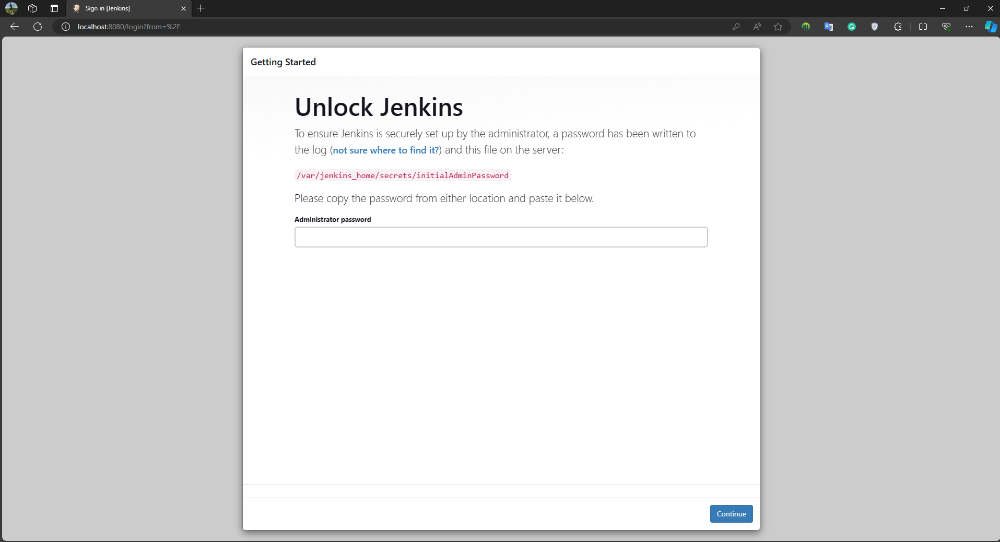
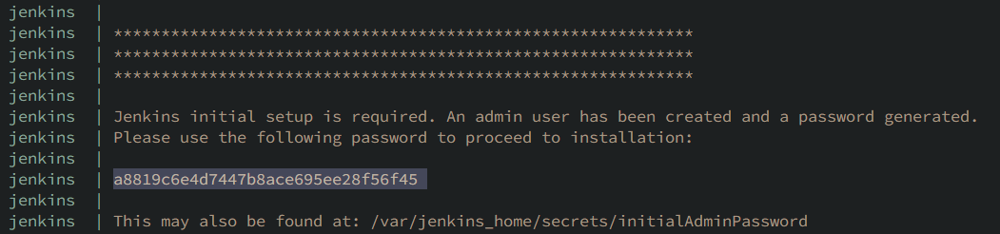
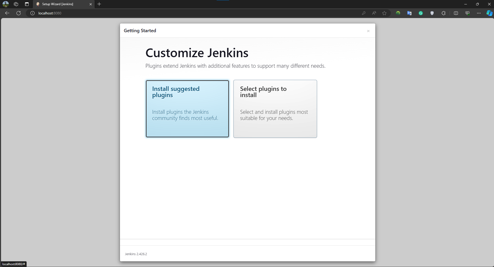
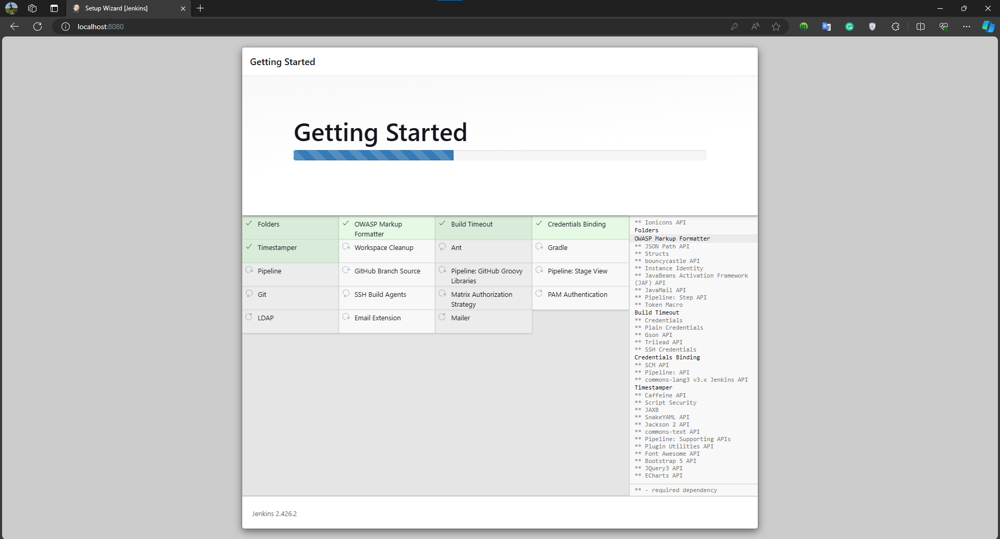
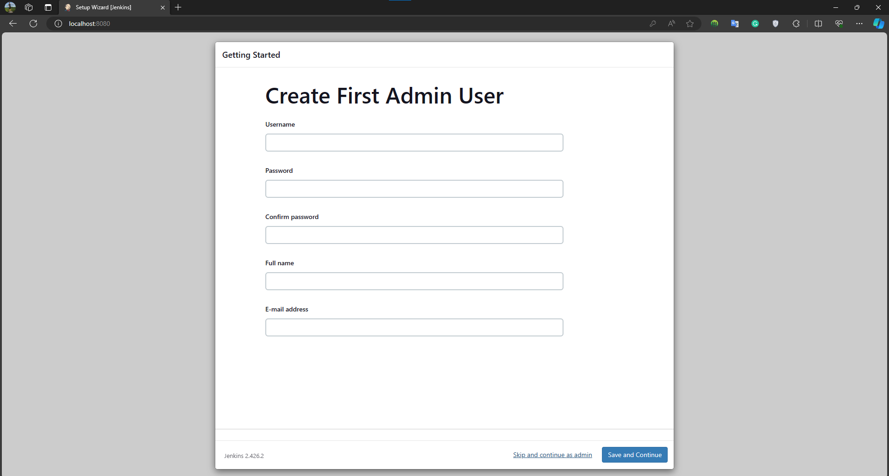
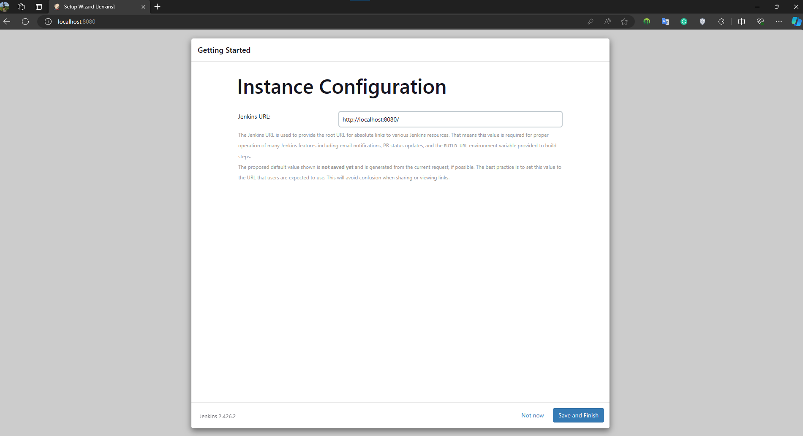
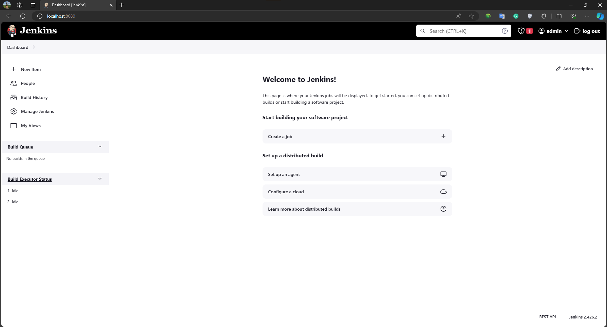
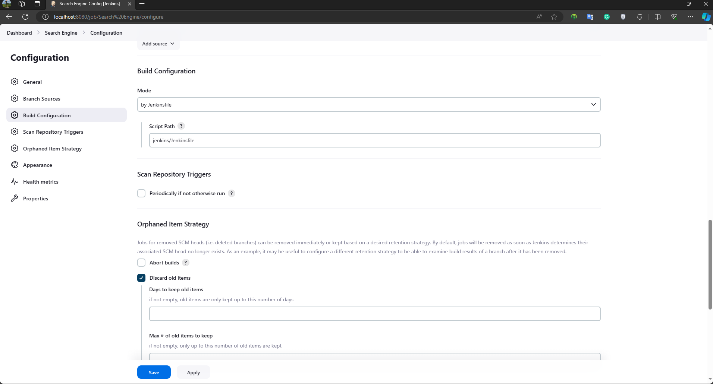
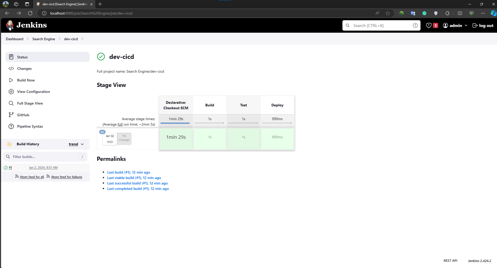

# Official Jenkins Docker Image

[](https://hub.docker.com/r/jenkins/jenkins/)
[](https://hub.docker.com/r/jenkins/jenkins/)
[](https://gitter.im/jenkinsci/docker?utm_source=badge&utm_medium=badge&utm_campaign=pr-badge&utm_content=badge)

The Jenkins Continuous Integration and Delivery server [available on Docker Hub](https://hub.docker.com/r/jenkins/jenkins).

This is a fully functional Jenkins server. For more information, visit [https://jenkins.io/](https://jenkins.io/).


## Table of Contents

- [Setup Jenkins](#setup-jenkins)
  1. [Run Jenkins using Docker Compose](#1-run-jenkins-using-docker-compose)
  2. [Access Jenkins and Login](#2-access-jenkins-and-login)
  3. [Read Container Logs to Get Password](#3-read-container-logs-to-get-password)
  4. [Install Suggested Plugins](#4-install-suggested-plugins)
  5. [Skip User Registration and Continue as Admin](#5-skip-user-registration-and-continue-as-admin)
  6. [Configure URL Instance](#6-configure-url-instance)
  7. [Explore Jenkins UI](#7-explore-jenkins-ui)
- [Create CI/CD Pipeline](#create-cicd-pipeline)
  1. [Get Access Token to Login to GitHub in Jenkins](#1-get-access-token-to-login-to-github-in-jenkins)
  2. [Set Up Pipeline](#2-set-up-pipeline)
  3. [Update Script Path](#3-update-script-path)
  4. [Build CI/CD](#4-build-cicd)

## Setup Jenkins

### 1. Run Jenkins using Docker Compose

```bash
docker compose up -d
```

### 2. Access Jenkins and Login

Visit [http://localhost:8080](http://localhost:8080) and log in.

<p align="center">
  
  <br>
  <em>Login Jenkins</em>
</p>

### 3. Read Container Logs to Get Password

```bash
docker logs jenkins
```

Alternatively,

```bash
docker exec -it jenkins cat /var/jenkins_home/secrets/initialAdminPassword
```

<p align="center">
  
  <br>
  <em>Get password in logs</em>
</p>

### 4. Install Suggested Plugins

Select "Install suggested plugins" and wait for Jenkins to install the required plugins.

<p align="center">
  
  <br>
  <em>Install suggested plugins</em>
</p>

<p align="center">
  
  <br>
  <em>Waiting for setup</em>
</p>

### 5. Skip User Registration and Continue as Admin

Choose "Skip and continue as admin" when prompted during user registration.

<p align="center">
  
  <br>
  <em>Skip and continue as admin</em>
</p>

### 6. Configure URL Instance

Set up the URL for the Jenkins instance.

<p align="center">
  
  <br>
  <em>Instance Configuration</em>
</p>

### 7. Explore Jenkins UI

Explore the Jenkins UI at [http://localhost:8080](http://localhost:8080).

<p align="center">
  
  <br>
  <em>Jenkins UI</em>
</p>

## Create CI/CD Pipeline

### 1. Get Access Token to Login to GitHub in Jenkins

Follow the GIF to obtain an access token in GitHub for Jenkins integration.

<p align="center">
  
  <br>
  <em>Get access token in Github</em>
</p>

_Remember to save the access token for the next step._

### 2. Set Up Pipeline

Add the saved access token in the password box when setting up the pipeline.

<p align="center">
  
  <br>
  <em>Set up pipeline</em>
</p>

### 3. Update Script Path

Update the script path as per your project configuration.

<p align="center">
  
  <br>
  <em>Script Path</em>
</p>

### 4. Build CI/CD

Initiate the CI/CD build process.

<p align="center">
  
  <br>
  <em>Build CI/CD</em>
</p>
